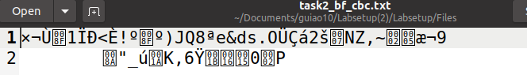
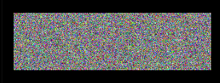

## Task 1

Frequency Analysis ajuda a partir cifras de substituição monoalfabéticas. Esta conta as ocurencias de cada caracter no texto cifrado para determinar a frequencia de cada um.

Para aplicar isto, temos de correr o programa em python (freq.py) sobre um ficheiro (ciphertext.py) e obtemos a frequecia de cada caracter.

Depois de analisarmos o resultado obtido pelo comando acima, conseguimos concluir algumas substituições como por exemplo, ‘ytn’ é ‘THE’, ‘v’ é ‘A’, ‘vu’ é ‘AN’ e ‘vy’ é ‘AT’.

O comando que temos de utilizar para converter o ciphertext é p o seguinte:
 

O texto que estava em ciphertext fica assim:

## Task 2

Nesta task, temos diferentes cifras com diferentes modos para encriptar e desencriptar um texto.

Para fazer isto primeiro temos de criar um ficheiro de texto (task2_file.txt).

Depois disto, temos de usar AES-128 cifra com o modo CBC, usamos o OPENSSL ENC, para conseguirmos encriptar e desencriptar o ficheiro de texto criado anteriormente.

AES-128-CBC

O ficheiro encriptado fica assim:

E o ficheiro desencriptado deu o mesmo resultado do texto incial:

Fazemos agora o BF(blowfish) com o modo CBC

BF-CBC

Texto encriptado:

Texto desencriptado:

## Task 3

ECB e CBC são 2 modos de cifrar com uma grande diferença . No modo CBC nos passamos o "iv" antes da encriptação.

Para mostrar  a diferença, nos encriptamos uma imagem e usamos AES-128 cifra com CBC e ECB .

Como a imagem é ".bpm", tivemos de concatenar o header da imagem original com o body da imagem encriptada.

Na imagem seguinte, temos a imagem orignal no topo a esquerda a iagem encriptada com AES usando ECB no topo a direita e a imagem encriptada com AES usando CBC em baixo.

De seguida fazemos o mesmo processo mas com uma imagem nossa.

 

As nossas observações são:

-O modo ECB deixa dados sobre a mensagem subjcente que esta a ser ecriptada. Razão pela qual isso acontece é porque este produz blocos de texto cifrados apos encriptar blocos de texto idênticos.

-O modo CBC elimina o problema de ECB. O texto simples de um bloco é combinado om um texto cifrado do bloco anterior via a operação XOR e o resultado é encriptado.