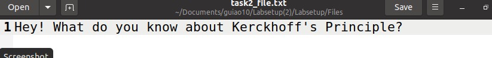

## Task 1

Frequency Analysis ajuda a partir cifras de substituição monoalfabéticas. Esta conta as ocurencias de cada caracter no texto cifrado para determinar a frequencia de cada um.

Para aplicar isto, temos de correr o programa em python (freq.py) sobre um ficheiro (ciphertext.py) e obtemos a frequecia de cada caracter.

Depois de analisarmos o resultado obtido pelo comando acima, conseguimos concluir algumas substituições como por exemplo, ‘ytn’ é ‘THE’, ‘v’ é ‘A’, ‘vu’ é ‘AN’ e ‘vy’ é ‘AT’.

O comando que temos de utilizar para converter o ciphertext é p o seguinte:
 

O texto que estava em ciphertext fica assim:

## Task 2

Nesta task, temos diferentes cifras com diferentes modos para encriptar e desencriptar um texto.

Para fazer isto primeiro temos de criar um ficheiro de texto (task2_file.txt).

Depois disto, temos de usar AES-128 cifra com o modo CBC, usamos o OPENSSL ENC, para conseguirmos encriptar e desencriptar o ficheiro de texto criado anteriormente.

AES-128-CBC

O ficheiro encriptado fica assim:

E o ficheiro desencriptado deu o mesmo resultado do texto incial:

Fazemos agora o BF(blowfish) com o modo CBC

BF-CBC

Texto encriptado:

Texto desencriptado:

