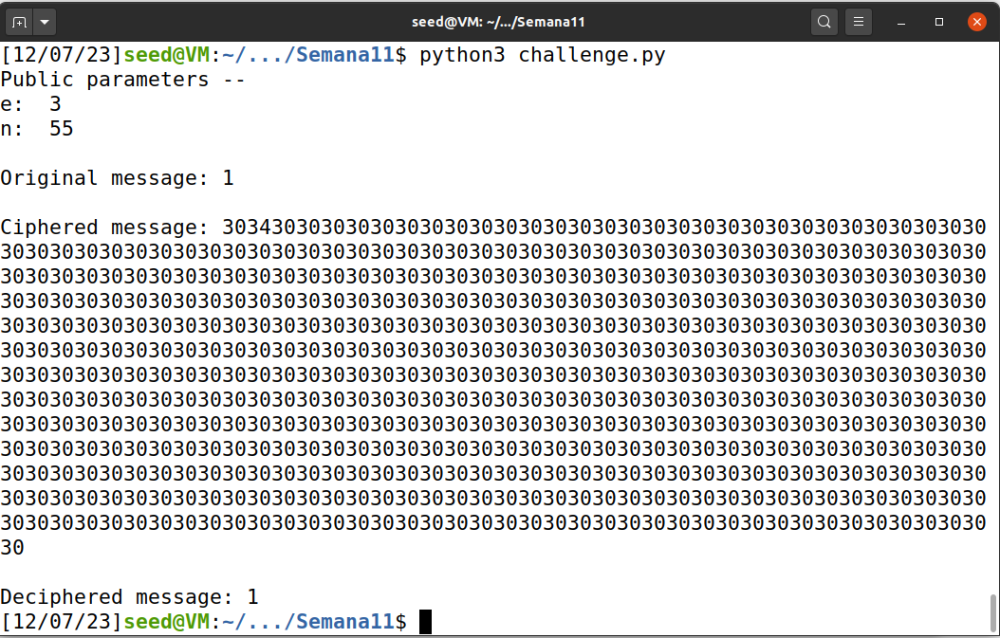
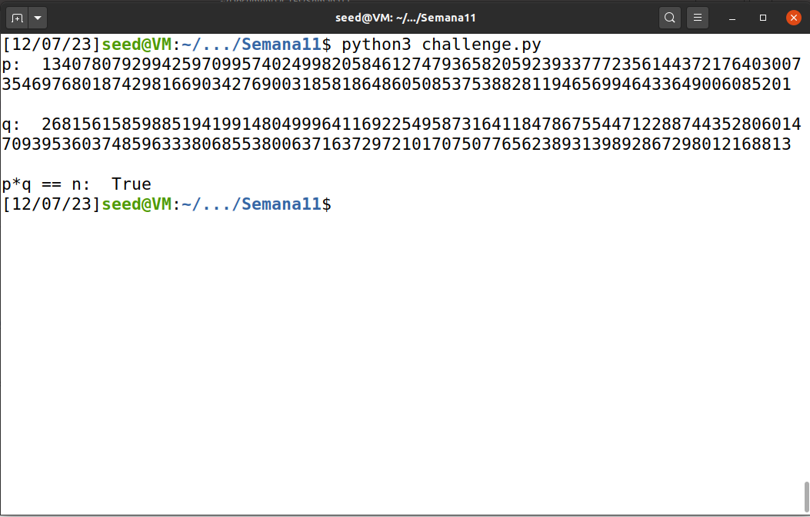
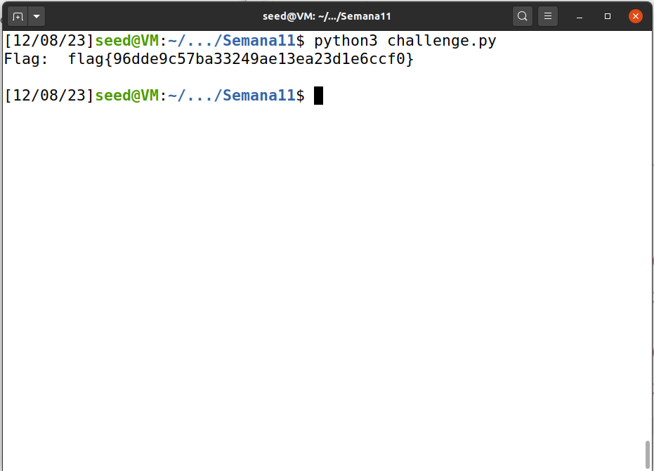

# Public-Key Infrastructure LAB

## Setup

Na fase inicial, adicionamos novas entradas aos hosts conhecidos pela máquina virtual e executamos os containers fornecidos no lab:

Deste formato:

```bash
sudo nano etc/hosts     # '10.9.0.80 www.bank32.com'

$ dcbuild             
$ dcup                  
```

## Task 1 -  Becoming a Certificate Authority (CA)

Copiamos o arquivo de configuração padrão de certificados (encontrado em /usr/lib/ssl/openssl.cnf) para o nosso diretório de trabalho. Prosseguimos com uma série de comandos para estabelecer o ambiente necessário para nossa CA pessoal:

```bash
mkdir ca
cd ca
mkdir certs
mkdir crl
mkdir newcerts
touch index.txt
echo "1000" >> serial
```

Depois fizemos setup da CA:

```bash
openssl req -x509 -newkey rsa:4096 -sha256 -days 3650 -keyout ca.key -out ca.crt
```

Durante o processo colocamos os seguintes dados:

```note
- passphrase (test)
- nome do país (PT)
- região (Maia)
- cidade (Maia)
- organização (FSI)
- secção (FEUP)
- nome (T04G07)
- email (test@fe.up.pt)
```

Para ver o conteúdo dos ficheiros gerados, decodificamos o certificado X509 e a chave RSA:

```bash
openssl x509 -in ca.crt -text -noout
openssl rsa -in ca.key -text -noout
```

Comprovamos que é self signed, uma vez que o campo <b>issuer</b> e <b>subject</b> são iguais.
```
Version: 3 (0x2)
Serial Number:
    ae:09:b9:46:7b:ff:3d:72:79:6a:0d:65:79:21:8f:af
Signature Algorithm: sha256WithRSAEncryption
Issuer: C = PT, ST = Maia, L = Maia, 0 = FSI, OU = FEUP, CN = T04G07, emailAddress: test@fe.up.pt.com
Validity
    Not Before: Dec 4 09:13:42 2022 GMT
    Not After : Dec 2 09:13:42 2032 GMT
Subject: C = PT, ST = Maia, L = Maia, 0 = FSI, OU = FEUP, CN = T04G07, emailAddress: test@fe.up.pt.com
Subject Public Key Info:
    Public Key Algorithm: rsaEncryption
```

No conteúdo do ficheiro gerado referente à criptografia conseguimos identificar o seguinte:
- os dois números primos (campo `prime1` e `prime2`);
- o *modulus* (campo `modulus`);
- os expoentes públicos e privados (campo `publicExponent` e `privateExponent`, respetivamente);
- o coeficiente (campo `coeficient`);

## Task 2 - Generating a Certificate Request for Your Web Server

Criamos a partir do seguinte comando certificado para o site `www.bank32.com`:

```bash
openssl req -newkey rsa:2048 -sha256 -keyout server.key -out server.csr -subj "/CN=www.bank32.com/O=Bank32 Inc./C=US"  passout pass:test -addext "subjectAltName = DNS:www.bank32.com, DNS:www.bank32A.com, DNS:www.bank32A.com"
```

Com isto obtivemos dois ficheiros: o RSA do site e o Certificado do site.


## Task 3 - Generating a Certificate for your server

De modo a criar um certificado para o nosso servidor www.bank32.com, executamos o seguinte comando:

```bash
$ openssl ca -config openssl.cnf -policy policy_anything -md sha256 -days 3650 -in server.csr -out server.crt -batch -cert ca.crt -keyfile ca.key
```

A identidade do nosso servidor é de facto um certificado para o www.bank32.com.

E agora, ao executar este código...

```bash
$ openssl x509 -in server.crt -text -noout
```

...de modo a vertificar que, ao descomentarmos a linha "copy_extensions = copy" do nosso ficheiro, mostra que o certificado cobre todos os nomes especificados que foram mencionados na tarefa anterior.


## Task 4 - Deploying Certificate in an Apache-Based HTTPS Website

Copiamos os ficheiros "server.ctf" e "server.key" para a pasta partilhada `/volumes` e mudamos os nomes para bank32, com a respetiva extensão. Modificamos o ficheiro "etc/apache2/sites-available/bank32_apache_ssl.conf" dentro do container, para que o certificado e chave usados sejam os da pasta partilhada:

```note
<VirtualHost *:443> 
    DocumentRoot /var/www/bank32
    ServerName www.bank32.com
    ServerAlias www.bank32A.com
    ServerAlias www.bank32B.com
    ServerAlias www.bank32W.com
    DirectoryIndex index.html
    SSLEngine On 
    SSLCertificateFile /volumes/bank32.crt
    SSLCertificateKeyFile /volumes/bank32.key
</VirtualHost>
```

Para iniciar o servidor Apache foi necessário primeiro abrir uma shell no container e inserir os seguintes comandos:

```bash
$ service apache2 start
```

Acessamos ao website https://bank32.com e notamos que a conexão era insegura (não criptografada). Então, para garantir a segurança da nossa conexão, incluímos o certificado CA que produzimos nas autoridades reconhecidas pelo navegador. Isso foi feito acessando about:preferences#privacy, selecionando Certificados -> Visualizar Certificados -> Autoridades -> Importar. Após este processo, constatamos que a conexão se tornou segura.

## Task 5 - Launching a Man-In-The-Middle Attack

A configuração do servidor foi modificada para agora apresentar o site `www.example.com` com as configurações anteriores. O ficheiro "etc/apache2/sites-available/bank32_apache_ssl.conf" ficou da seguinte forma:

```note
<VirtualHost *:443> 
    DocumentRoot /var/www/bank32
    ServerName www.bank32.com
    ServerAlias www.bank32A.com
    ServerAlias www.bank32B.com
    ServerAlias www.bank32W.com
    DirectoryIndex index.html
    SSLEngine On 
    SSLCertificateFile /volumes/bank32.crt
    SSLCertificateKeyFile /volumes/bank32.key
</VirtualHost>

<VirtualHost *:80> 
    DocumentRoot /var/www/bank32
    ServerName www.example.com
    DirectoryIndex index_red.html
</VirtualHost>
```

Alteramos igualmente o DNS do alvo, associando o hostname www.example.com ao IP do servidor web malicioso.

Ao reconstruír o servidor e ir ao site `www.example.com` verificamos que o browser alerta para um potencial risco.

Esta situação ocorre devido à discrepância no certificado utilizado, pois o nome de domínio não corresponde ao que está registrado no certificado do servidor.


## Task 6 - Launching a Man-In-The-Middle Attack with a Compromised CA

Considerando que o nosso CA está comprometido, este pode ser empregado na criação de certificados para um site malicioso. Neste caso, desejamos gerar um certificado para o site www.example.com, portanto, replicamos os passos da Tarefa 2:

```bash
$ openssl req -newkey rsa:2048 -sha256 -keyout example.key -out example.csr -subj "/CN=www.example.com/O=example Inc./C=US" -passout pass:test
$ openssl ca -config openssl.cnf -policy policy_anything -md sha256 -days 3650 -in example.csr -out example.crt -batch -cert ca.crt -keyfile ca.key
```

Depois modificamos o ficheiro de configuração do servidor `etc/apache2/sites-available/bank32_apache_ssl.conf` para utilizar os dois ficheiros originados: **example.crt** e **example.key**:

```note
<VirtualHost *:443> 
    DocumentRoot /var/www/bank32
    ServerName www.bank32.com
    ServerAlias www.bank32A.com
    ServerAlias www.bank32B.com
    ServerAlias www.bank32W.com
    DirectoryIndex index.html
    SSLEngine On 
    SSLCertificateFile /volumes/example.crt
    SSLCertificateKeyFile /volumes/example.key
</VirtualHost>

<VirtualHost *:80> 
    DocumentRoot /var/www/bank32
    ServerName www.bank32.com
    DirectoryIndex index_red.html
</VirtualHost>
```

Após reiniciar o servidor e ir a www.example.com, confirmámos que ligação já é segura.

## CTF 11

Começamos por estudar o script python fornecido no ficheiro 'challenge.py', de modo a entender melhor o processo de encriptação e desencriptação por RSA, feito pelas funções 'enc()' e 'dec()'. Também corremos um simples teste, com parâmetros muito pequenos (p=5; q=11; n=55, produto de p e q; e=3, coprimo de 5 e 11; e d=27, calculado sabendo que e*d = 1 mod ((p-1)*(q-1))), onde testamos encriptar e desencriptar uma mensagem muito simples '1', uma vez que era um caracter com representação em bytes, inferior ao nosso n de 55, o que é necessário para que o algoritmo de RSA funcione.

```python
# Python Module ciphersuite
import os
import sys
from binascii import hexlify, unhexlify

FLAG_FILE = './flags/flag.txt'

def enc(x, e, n):
    int_x = int.from_bytes(x, "little")
    y = pow(int_x,e,n)
    return hexlify(y.to_bytes(256, 'little'))

def dec(y, d, n):
    int_y = int.from_bytes(unhexlify(y), "little")
    x = pow(int_y,d,n)
    return x.to_bytes(256, 'little')

with open(FLAG_FILE, 'r') as fd:
	un_flag = fd.read()

p = 5
q = 11
n = 55 #(p * q)
e = 3  #coprime to (p-1)*(q-1)
d = 27 #(e*d = 1 mod ((p-1)*(q-1)))

m = "1"

ciphered_text = enc(m.encode(), e, n)
deciphered_text = dec(ciphered_text, d, n)

print("Public parameters -- \ne: ", e, "\nn: ", n)
print("\nOriginal message:", m)
print("\nCiphered message:", hexlify(ciphered_text).decode())
print("\nDeciphered message:", deciphered_text.decode())
sys.stdout.flush()
```



Ao testar a ligação ao servidor várias vezes, reparamos que o valor de n usado para a cifra, mudava todas as vezes (supostamente, por valores diferentes para p e q serem escolhidos), alterando ligeiramente também a encriptação, pelo que decidimos guardar os valores recibidos numa específica conexão ao servidor:

```note
Public parameters -- 
e:  65537

n:  359538626972463181545861038157804946723595395788461314546860162315465351611001926265416954644815072042240227759742786715317579537628833244985694861278986206259785454342119864617374359952879082323544262969822346940123477678654063974439152327219764977930491501559698538489861469119200053349189066319584673036413

ciphertext: 3730323135626434363832396332353639633038623137653338343465366365633937323065323862623536343237363836653436313065656633396562336330346138386361663166316332396564356234623762633361356430616261616230623330636463376563303138313966393034643934383436646236333933633630323134616334343037393764666361663561306239366332616237363861653030616361353235306139656566626531393934633639353766613631633166323962616434333330643266313738643266353864333033633239613338313635613130393964353931333562343265663863633161346666336334646330303030303030303030303030303030303030303030303030303030303030303030303030303030303030303030303030303030303030303030303030303030303030303030303030303030303030303030303030303030303030303030303030303030303030303030303030303030303030303030303030303030303030303030303030303030303030303030303030303030303030303030303030303030303030303030303030303030303030303030303030303030303030303030303030303030303030303030303030303030303030303030303030303030303030303030303030303030303030303030303030303030303030303030303030303030
```

A tarefa principal do desafio, é encontrar os valores para p e q, deforma a calcular d, e podermos aplicar a função de desencriptação fornecida no template.
Sabemos que são valores primos próximos de 2^512 e 2^253, respetivamente. Precisamos em primeiro lugar de definir uma função para testar a primalidade de números. Utilizamos uma, do site rosetta code, que implementa o algoritmo de Miller Rabin, com alta probabilidade dos números declarados como primos, o serem de facto, e é eficiente para grandes valores. Depois definimos uma simples função "find_next_prime", que obtem o primeiro número primo superior ao número fornecido (Não tínhamos a certeza se os valores de p e q seriam superiores ou inferiores aos valores a que são próximos. Testamos superiores, e funcionou. Caso o loop que obtem p e q fosse infinito, teríamos facilmente alterado esta função para obter o primeiro primo inferior invés do superior). Por fim implementamos a função "find_p_q", que procura valores próximos dos valores fornecidos, que sejam primos e cujo o produto seja igual ao valor de n obtido.

```python
def is_Prime(n):
    """
    Miller-Rabin primality test.

    A return value of False means n is certainly not prime. A return value of
    True means n is very likely a prime.
    """
    if n != int(n):
        return False
    n = int(n)
    #Miller-Rabin test for prime
    if n==0 or n==1 or n==4 or n==6 or n==8 or n==9:
        return False
        
    if n==2 or n==3 or n==5 or n==7:
        return True
    s = 0
    d = n-1
    while d%2 == 0:
        d >>= 1
        s += 1
    assert(2**s * d == n-1)
  
    def trial_composite(a):
        if pow(a, d, n) == 1:
            return False
        for i in range(s):
            if pow(a, 2**i * d, n) == n-1:
                return False
        return True  
 
    for i in range(8):#number of trials 
        a = random.randrange(2, n)
        if trial_composite(a):
            return False
 
    return True
    
def find_next_prime(n):
	x = n + 1
	while is_Prime(x) == False:
		x += 1
	return x

def find_p_q(start_p, start_q, target):
	p = find_next_prime(start_p)
	while True:
		q = find_next_prime(start_q)
		prod = p*q
		while prod <= target:
			if prod == target:
				return (p, q)
				
			q = find_next_prime(q)
			prod = p*q
			
		p = find_next_prime(p)
```



Tendo obtido os valores de p e q, calculamos o valor de d, traduzindo a sua equação por 'd = pow(e, -1, ((p-1)*(q-1)))'. Finalmente, apenas convertemos a flag obtida no formato que é esperado utilizar com a função 'dec()' (com os testes que corremos no início, apercebemo-nos que esse formato requiria converter aquilo que era transmitido pelo servidor, usando encode() e unhexlify()), e corremos o algoritmo, guardando o resultado numa variável 'flag', que imprimimos no terminal.

```c
ciphered_flag = unhexlify('3730323135626434363832396332353639633038623137653338343465366365633937323065323862623536343237363836653436313065656633396562336330346138386361663166316332396564356234623762633361356430616261616230623330636463376563303138313966393034643934383436646236333933633630323134616334343037393764666361663561306239366332616237363861653030616361353235306139656566626531393934633639353766613631633166323962616434333330643266313738643266353864333033633239613338313635613130393964353931333562343265663863633161346666336334646330303030303030303030303030303030303030303030303030303030303030303030303030303030303030303030303030303030303030303030303030303030303030303030303030303030303030303030303030303030303030303030303030303030303030303030303030303030303030303030303030303030303030303030303030303030303030303030303030303030303030303030303030303030303030303030303030303030303030303030303030303030303030303030303030303030303030303030303030303030303030303030303030303030303030303030303030303030303030303030303030303030303030303030303030303030'.encode())
n = 359538626972463181545861038157804946723595395788461314546860162315465351611001926265416954644815072042240227759742786715317579537628833244985694861278986206259785454342119864617374359952879082323544262969822346940123477678654063974439152327219764977930491501559698538489861469119200053349189066319584673036413
e = 65537
p = 13407807929942597099574024998205846127479365820592393377723561443721764030073546976801874298166903427690031858186486050853753882811946569946433649006085201
q = 26815615859885194199148049996411692254958731641184786755447122887443528060147093953603748596333806855380063716372972101707507765623893139892867298012168813
d = pow(e, -1, ((p-1)*(q-1)))

flag = dec(ciphered_flag, d, n)

print("Flag: ", flag.decode())

sys.stdout.flush()
```

