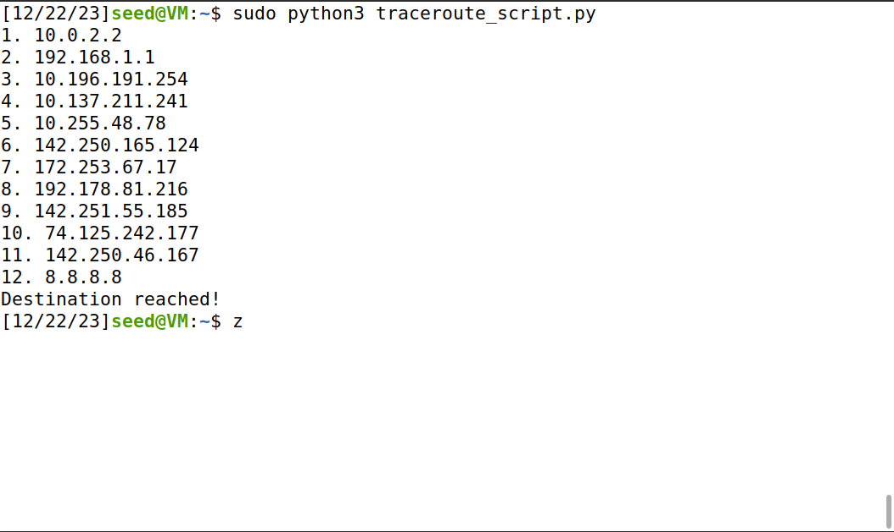
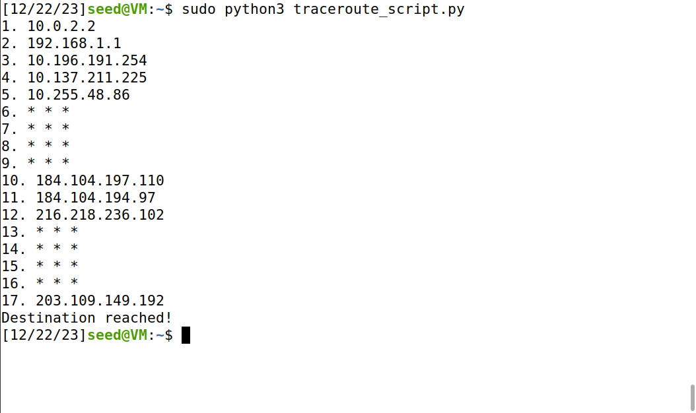

# Task 1

## Task 1.1

### Task 1.1A


Executado com `sudo`, ele funciona para detectar o pacote IP conforme o esperado. Por exemplo, ao usar o Firefox para visitar o site: https://seedsecuritylabs.org/


```
###[ Ethernet ]### 
  dst       = 52:54:00:12:35:00
  src       = 08:00:27:36:b5:ca
  type      = 0x800
###[ IP ]### 
     version   = 4
     ihl       = 5
     tos       = 0xc0
     len       = 158
     id        = 27438
     flags     = 
     frag      = 0
     ttl       = 64
     proto     = icmp
     chksum    = 0x6acb
     src       = 10.0.2.15
     dst       = 75.75.76.76
     \options   \
....
```

O erro seguinte acontece quando o programa é executado sem privilegio de root (sudo), implicando que o sniffer não corra.

```
Traceback (most recent call last):
  File "sniffer.py", line 7, in <module>
    pkt = sniff(filter='icmp',prn=print_pkt)
  File "/home/seed/.local/lib/python2.7/site-packages/scapy/sendrecv.py", line 731, in sniff
    *arg, **karg)] = iface
  File "/home/seed/.local/lib/python2.7/site-packages/scapy/arch/linux.py", line 567, in __init__
    self.ins = socket.socket(socket.AF_PACKET, socket.SOCK_RAW, socket.htons(type))
  File "/usr/lib/python2.7/socket.py", line 191, in __init__
    _sock = _realsocket(family, type, proto)
socket.error: [Errno 1] Operation not permitted
```

### Task 1.1B

Consulte a [documentation](https://scapy.readthedocs.io/en/latest/usage.html#generating-sets-of-packets) do modulo  `scapy` e a [BPF syntax](https://biot.com/capstats/bpf.html), posso passar as seguintes strings como argumento `filter` em `sniff`:

- `proto icmp` / `icmp`
- `tcp dst port 23 and src host x.x.x.x`
- `net 128.230.0.0/16`


## Task 1.2

Criamos um programa sniffer usando python com filtro icmp e cada pacote que é sniffed é impresso pela função print_pkt.

```python
>>> from scapy.all import *
>>> a = IP(src="x.x.x.x") # substituir por qualquer endereço IP do qual desejamos enviar pacotes
>>> b = ICMP() 
>>> p = a/b
>>> send(p)
```

## Task 1.3
Escrevemos este simples script python, que cria um packet com um cero ip de destino, e um valor de ttl, incrementado até um valor máximo predefenido, e que lê a resposta, dentro de um tempo limite de 1 segundo para uma variável reply. O ciclo termina, se o limite de "saltos" entre diferentes ips for atingido, ou se a fonte da resposta obtida, for o endereço ip de destino.
```python
from scapy.all import IP, ICMP, sr1

destination_ip = '8.8.8.8'
max_hops = 30

for ttl in range(1, max_hops + 1):
    packet = IP(dst=destination_ip, ttl=ttl) / ICMP()
    reply = sr1(packet, verbose=0, timeout=1)
    
    if reply is None:
        # Não obteve resposta dentro do timeout
        print(f"{ttl}. * * *")
    else:
        # Mostrar o endereço ip do router que respondeu
        print(f"{ttl}. {reply.src}")

        # Verificar se o ip de destino foi alcançado
        if reply.src == destination_ip:
            print("Destination reached!")
            break

```
Corremos 2 exemplos de teste, um, acima, com o endereço ip do servidor DNS do google, "8.8.8.8", alcançando o destino em 12 saltos (ttl=12).



No segundo teste utilizamos o endereço de ip, de um dos servidores DNS públicos da vodafone na Nova Zelândia. O destino foi alcançado com 17 saltos (ttl=17), sendo que para alguns valores de ttl inferiores a 17, não foi possível obter resposta, dentro do timeout de 1s. 

```python
destination_ip = '203.109.149.192'
```



## Task 1.4
```python
from scapy.all import sniff, IP, ICMP, send

def spoof_icmp(pkt):
    if ICMP in pkt and pkt[ICMP].type == 8:  # Pedido echo ICMP
        # Falsificar um pedido echo ICMP
        spoofed_pkt = IP(src=pkt[IP].dst, dst=pkt[IP].src) / ICMP(type=0, id=pkt[ICMP].id, seq=pkt[ICMP].seq)
        
        # Enviar o pacote falsificado
        send(spoofed_pkt, verbose=0)

# Capturar pacotes ICMP e chama spoof_icmp por cada pacote correspondente
sniff(prn=spoof_icmp, filter="icmp", store=0)
```
Este script utiliza a biblioteca Scapy para realizar a captura (sniff) e a falsificação (spoof) de pacotes ICMP. Quando o script identifica um pedido de eco ICMP (ping request), ele imediatamente envia uma resposta de eco ICMP falsificada para o remetente original do pedido.

### Observações dos Pings:

* ping 1.2.3.4 - Host inexistente na Internet:
    - O script detecta o pedido de eco ICMP para o endereço 1.2.3.4 e envia uma resposta falsificada.
    - O programa de ping no contentor do utilizador recebe a resposta falsificada e indica que o host inexistente em 1.2.3.4 está "ativo".

* ping 10.9.0.99 - Host inexistente na LAN:
    - Similarmente, o script detecta o pedido de eco ICMP para o endereço 10.9.0.99 e envia uma resposta falsificada.
    - O programa de ping no contentor do utilizador recebe a resposta falsificada e indica que o host inexistente em 10.9.0.99 está "ativo".

* ping 8.8.8.8 - Host existente na Internet:
    - O contentor do utilizador envia um pedido de eco ICMP ao servidor DNS público da Google em 8.8.8.8.
    - O script detecta o pedido de eco ICMP e envia uma resposta falsificada.
    - O programa de ping no contentor do utilizador recebe a resposta falsificada e erroneamente indica que o host em 8.8.8.8 está "ativo".

Com base nos pings observados, conclui-se que a técnica de sniffing e spoofing implementada no script Scapy é eficaz na falsificação de respostas de eco ICMP. Independentemente da existência real dos hosts, o script engana o programa de ping, indicando que todos estão "ativos"
