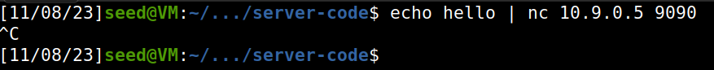

**Task 1**

Começamos por compilar o servidor que contem a format string vulnerability. De seguida enviamos a mensagem hello para o servidor com a vulnerabilidade e vemos a mensagem que o servidor nos envia.

| Terminal 1  | terminal 2 |
| ------ | ------ |
|        |

Para finalizar damos 'crash' ao progrma da seguinte maneira:

| Terminal 1  | Terminal 2 |
| ------ | ------ |
|        |        |
|        |        |
