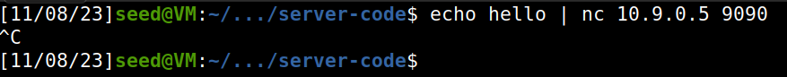
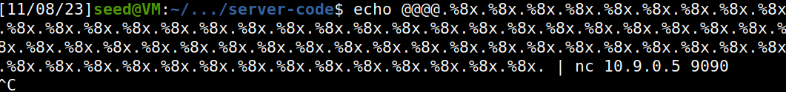
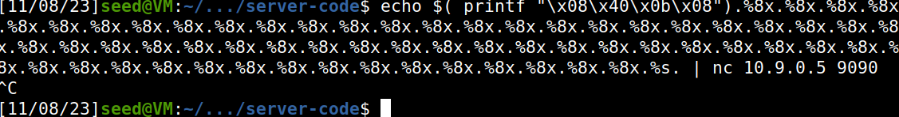
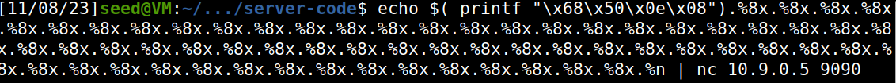
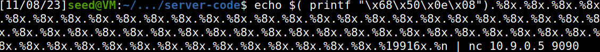

##Task 1

Começamos por compilar o servidor que contem a format string vulnerability. De seguida enviamos a mensagem hello para o servidor com a vulnerabilidade e vemos a mensagem que o servidor nos envia.

| Terminal 1  | terminal 2 |
| ------ | ------ |
|        | .png)

Para finalizar damos 'crash' ao progrma da seguinte maneira:

| Terminal 1  | Terminal 2 |
| ------ | ------ |
|   lab7.png)     |    .png)    |

##Task 2

**Task 2.A**

Para imprimir dados da pilha, considerando que temos uma vulnerabilidade na função myprintf, basta enviar para o servidor o comando %8x, o que nos permitirá obter os endereços de memória dos valores da pilha. Para identificar onde exatamente começa o buffer, inserimos 4 caracteres aleatórios que podem ser facilmente reconhecidos por nós. No nosso caso, usamos "@@@@" (valor ASCII = 40404040), dessa forma podemos determinar o tamanho exato do buffer.

| Terminal 1  | Terminal 2 |
| ------ | ------ |
|        |    .png)    |

**Task 2.B**

 Para imprimir os dados da heap, armazenamos o endereço da variável na memória heap, usando a vulnerabilidade de formatação de strings. Isso é feito passando o endereço de memória da variável para a pilha e, em seguida, enviando %8x (um número de vezes igual ao tamanho do buffer, menos um) seguido de %s. Isso faz com que o programa leia o endereço de memória armazenado na pilha e, em seguida, obtenha o valor associado a ele.

 | Terminal 1  | Terminal 2 |
| ------ | ------ |
|        |    .png)    |

##Task 3

**Task 3.A**
Alteramos o valor da variável:

 | Terminal 1  | Terminal 2 |
| ------ | ------ |
|        |    .png)    |

Ao fornecer a entrada acima ao servidor, passando o endereço de memória da variável de destino, alteramos o valor da variável de destino de 0x11223344 para 0x0000023c. Isso ocorre porque imprimimos 572 caracteres (71 * 8 + 4) e, ao inserir %n no endereço que armazenamos na pilha, alteramos o valor da variável de destino.

**Task 3.B**

Alteramos o valor alvo para 0x5000

| Terminal 1  | Terminal 2 |
| ------ | ------ |
|        |    .png)    |

Desta vez, temos que imprimir um número exato de bytes para obter um valor exato da variável de destino, que é 20480 (0x5000 = 20480 em decimal).

