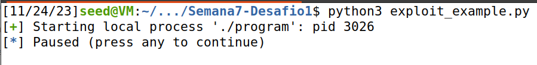
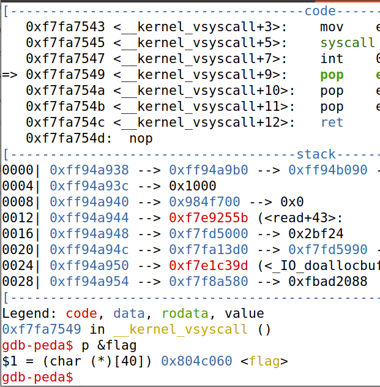
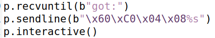
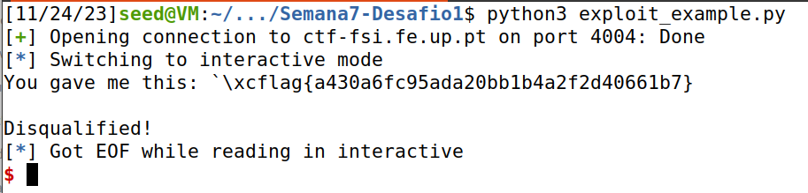

## Task 1

Começamos por compilar o servidor que contem a format string vulnerability. De seguida enviamos a mensagem hello para o servidor com a vulnerabilidade e vemos a mensagem que o servidor nos envia.

| Terminal 1  | terminal 2 |
| ------ | ------ |
|        | .png)


Para finalizar damos 'crash' ao progrma da seguinte maneira:


| Terminal 1  | Terminal 2 |
| ------ | ------ |
|   lab7.png)     |    .png)    |

## Task 2

**Task 2.A**

Para imprimir dados da pilha, considerando que temos uma vulnerabilidade na função myprintf, basta enviar para o servidor o comando %8x, o que nos permitirá obter os endereços de memória dos valores da pilha. Para identificar onde exatamente começa o buffer, inserimos 4 caracteres aleatórios que podem ser facilmente reconhecidos por nós. No nosso caso, usamos "@@@@" (valor ASCII = 40404040), dessa forma podemos determinar o tamanho exato do buffer.


| Terminal 1  | Terminal 2 |
| ------ | ------ |
|        |    .png)    |

**Task 2.B**

 Para imprimir os dados da heap, armazenamos o endereço da variável na memória heap, usando a vulnerabilidade de formatação de strings. Isso é feito passando o endereço de memória da variável para a pilha e, em seguida, enviando %8x (um número de vezes igual ao tamanho do buffer, menos um) seguido de %s. Isso faz com que o programa leia o endereço de memória armazenado na pilha e, em seguida, obtenha o valor associado a ele.

 | Terminal 1  | Terminal 2 |
| ------ | ------ |
|        |    .png)    |


## Task 3

**Task 3.A**
Alteramos o valor da variável:

 | Terminal 1  | Terminal 2 |
| ------ | ------ |
|        |    .png)    |

Ao fornecer a entrada acima ao servidor, passando o endereço de memória da variável de destino, alteramos o valor da variável de destino de 0x11223344 para 0x0000023c. Isso ocorre porque imprimimos 572 caracteres (71 * 8 + 4) e, ao inserir %n no endereço que armazenamos na pilha, alteramos o valor da variável de destino.

**Task 3.B**

Alteramos o valor alvo para 0x5000

| Terminal 1  | Terminal 2 |
| ------ | ------ |
|        |    .png)    |

Desta vez, temos que imprimir um número exato de bytes para obter um valor exato da variável de destino, que é 20480 (0x5000 = 20480 em decimal).

## CTF Desafio 1
Começamos por correr o script python e salvar o pid do processo a correr:



Deseguida corremos o gdb com o pid obtido. Uma vez que a flag é guardada numa variável global, e, como verificado ao correr checksec no programa compilado, os endereços são estáticos, se obtivermos o endereço da variável onde a flag é guardada, conseguiremos explorá-lo para obter a flag. Para isso corremos o comando "gdb p &flag"



Colocamos o endereço obtido invertido (arquitetura little endian), seguido pelo especificador de formato "%s". Este input será guardado por "scanf" no buffer, e ao correr "printf(buffer)", o especificador de formato, vez que não é especificado outro argumento, irá ler a memória guardada no endereço especificado imediatamente acima na stack, ou seja, o endereço da flag que inserimos no input, imprimindo assim o seu valor para o terminal.


   


## CTF Desafio 2

Inicialmente, analisamos os arquivos disponíveis, os quais são os mesmos que estão ativos no servidor na porta 4005. Descobrimos que o uso do comando checksec revelou que o executável program não está alocado num local fixo na memória, o que sugere que o código pode ser executado de qualquer posição. Adicionalmente, foi observado que medidas de segurança, como a proteção contra buffer overflow, não estavam em vigor.

Para explorar o arquivo main.c e manipular o valor da variável key para obter a <b>flag</b>, é necessário modificar seu valor para <i>beef</i>, que em decimal corresponde a 4779.

A seguir, precisamos localizar o endereço de memória da variável key e alterá-lo. Isto pode ser feito localizando a chave no servidor.

Depois, é necessário ajustar o valor da key para 4779 (beef). Para isso, precisamos escrever 4775 bytes (acrescidos de 4 bytes para o endereço desejado) antes de executar o comando que substituirá efetivamente o valor. Devemos incluir uma sequência de 'no-operation' (NOPs) antes de enviar os dados, para assegurar que o código malicioso seja executado sem interrupções.

O script Python deve ser ajustado da seguinte forma para realizar a injeção:

```python
p.recvuntil("some text")
p.sendline(b"NOPs" + b"\x24\xB3\x04\x08" + b"beef" + b"\x90\x90\x90\x90")
p.interactive()
```

Ao executar o script, obteremos a flag desejada.