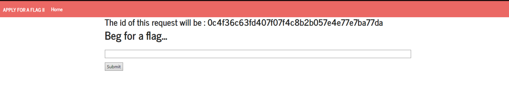

Para realizar este ctf, teremos de trabalhar a partir desta página:



A partir dessa página, apercebemo-nos que poderíamos testar se input que aí pediam era filtrado ou não. Para testar essa condição, decidimos criar uma função `alert()`, da seguinte maneira:

```
<script>alert("Teste");</script>
```

Obtendo este resultado:

