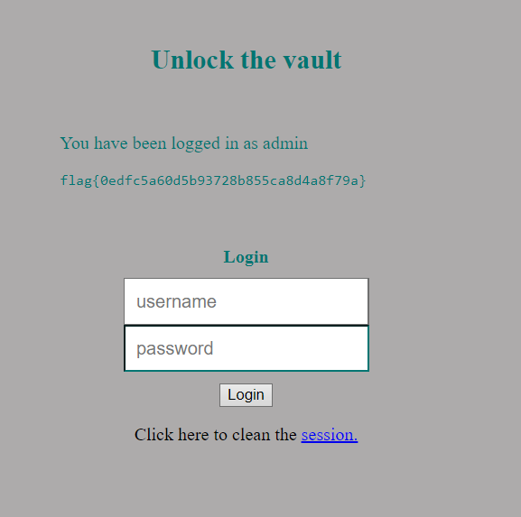

# CTF 4 - Semana 8

No início, analisamos os arquivos fornecidos na plataforma CTF, que são idênticos aos que estão a rodar no servidor na porta 5003. Observamos que o sistema utiliza o banco de dados SQLite3 e que, ao inserir 'admin' como nome de usuário, o conteúdo do arquivo flag.txt é exibido na página da web. Durante o processo de autenticação, a consulta SQL é vulnerável, pois o servidor gera o comando de forma dinâmica utilizando os dados de entrada do usuário, que não são verificados adequadamente:

```php
$username = $_POST['username'];
$password = $_POST['password'];             
$query = "SELECT username FROM user WHERE username = '".$username."' AND password = '".$password."'";
```
Ao empregar a injeção SQL com o input "admin'--", conseguimos acesso privilegiado. Isso acontece porque a verificação de senha é efetivamente neutralizada pela inserção de um comentário SQL. Com isso, o comando executado pelo servidor fica neste formato:

```sql
SELECT username FROM user WHERE username = 'admin'-- AND password = $password
```

Como resultado, logamos com sucesso na conta do administrador, acessando o conteúdo do arquivo flag.txt e obtendo a flag do desafio.

